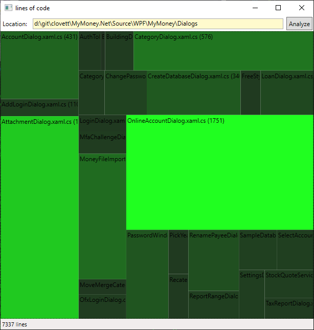

## Tools

This is my collection of little tools mostly built in C#

### AngleMeasurer
Trivial WPF app that lets you measure angles on a any bitmap that you paste in:
.

### AppBarButtonStyles

Trivial UWP app that shows all the Symbol Font icons.

### AutomaticPairingDemo

Windows 8 app that shows how to use the new Bluetooth API's to perform
automatic sniffing of nearby BLE devices and pairing of those devices.

### BatchPhotoScan

A WPF app that uses windows image acquisition API to interact with a scanner plugged into your PC and makes it easy to scan a box full of photos, and crop and touch them up, and save them with incremental
file names to a target folder.

### BlogMLToWordpress

Simple command line tool that converts Blog Engine ML metadata to
Wordpress format.

### BluetoothConsole

An old Windows 8 bluetooth demo app.

### bom

A simple command line tool for editing the byte order mark at the
beginning of a file.

### CapabilityMapping

A little tool to compare WindowsCapabilities...

### Chimpmunk

Beginnings of a UWP app that figures out optimal wood cutting patterns...

### CIncludeGraph

Command line tool that grocs the C++ include graph for a given number of C++ files and outputs a DGML graph.

### CleanupVideos

Command line tool that moves videos from Pictures folder to Videos folder
preserving the folder hierarchy of the videos.

### Clocks

An implementation of the Eaton Aerosmith Clocks program.

### ColorPicker

Incomplete WPF app.  Currently converts RGB to HEX and shows you the color.

### ComponentDependency

Finds all installed components matching the given pattern and creates the dependency graph.

### Dashboard

A Windows 8 demo app shows a pretty Dashboard with radial dials and so forth.

### DataVisualization

A UWP version of my LogViewer app...incomplete...

### DateSpinnerSample

A nice Windows 8 control for picking dates, I use it in my FunChores app.

### DesktopBackgroundSlideshow

A simple tool that you can run when you log in to randomly pick a new desktop
wallpaper image.

### Diff

A simple command line "diff" program that can find differences in 2 text files, uses a Google library.

### dumphex

A simple command line tool that dumps a file as hexadecimal.

### EnergyHub

A tool that plays with Efergy energy monitor.
See my [blog](https://lovettchris.github.io/posts/efergy_power_monitor/)
about it.

### FidelityShowDetails

A web browser monkey keyboard app that expands all sections of a
particular 401k statement so I can save then the page as PDF and save all
the details in the page.

### FileDateTakenSorter

A command line tool that uses Windows Extended storage properties API
to extract the real date a photo was taken, which it then uses to rename
the photos IMG_{}.* where the index encodes the date taken order.

### FileSync

Incomplete, work in progress, couldn't find the original FileSync
source code, so I was about to rebuild it, but MergePhotos is
the current focus...

### FileTreeMap

A WPF TreeMap implementation that shows number of lines in each file in a given sub-folder, shown in a TreeMap user interface.



### MergePhotos

Command line tool that merges 2 folders, eliminating duplicates.
It also merges .xmp metadata correctly to avoid the number of c
conflicts you might otherwise get in the process.

### FontExplorer

A Windows 8 app that provides a nice UI for picking available fonts.

### FtpMirror

A handy command line tool that mirrors a local folder up to an FTP server location.

### GasBook

A windows 8 app that provides simple way to log car gas usage (incomplete)

### Grep

A simple command line grep tool that uses System.Text.RegularExpressions
implementation of regular expressions.

### GrovelIncludes

Looks like another implementation of CIncludeGraph...

### HtmlScraper

Parses HTML files finding elements matching given xpath location and prints them.

### HttpCopy

Downloads the content at the given url and stores it in a local file.

### HttpGet

Downloads the given URL and provides a "deep" option that grabs all
the linked content as well, including CSS, Audio, Images, SVG,
Scripts and Zip files.  This can for example, scrape all the content
from a Stanford online class and store it locally so you access it offline.

### HttpHead

Print HTTP headers returned from a given URL.

### ildepends

Analyze a bunch of .NET assemblies and produces a DGML graph of the
dependencies between them all.

### Journal

Incomplete Windows 8 app designed to be used as a personal diary type thing.

### KeyboardMonkey

Handy little WPF app that will record a bunch of keystrokes you play
on a given app, then replay them.  It is handy way to build macros that do repetative edits in VS.

### LogViewer

A pretty nice WPF PX4 drone log viewer application, supports PX4 logs,
and mavlink logs.

### MeetingBuzzer

(incomplete) An app that tries really hard to get my attention so I don't miss
meetings while I'm deep in the coding groove...

### MsBuildImportGraph

Create DGML graph from project dependencies in an MSBuild solution.

### NetgearDataUsage

Program that downloads network usage data from netgear router and
shows a usage graph.

### NetworkDataUsage

Program that downloads network usage data from comcast server and
shows your usage (incomplete)

### NormalizeNewlines

Program that converts newlines in a given text from to windows (\r\n) or
linux (\n) style newlines.

### OutlookSync

Program that synchronizes OutLook contacts with Windows 8 Phone contacts.
See [demo video](http://lovettsoftware.com/videos/OutlookSync.mp4).

### PhoneIconMaker

Program that generates icons for windows phone (incomplete)

### PowerMonitor

Arduino sketch for monitoring Efergy power monitor.

### ppxml

Pretty print XML, lots of options.

### Prompt

Simple GUI prompt app, useful for use by command line scripts.

### qlock

C++ command line tool to query why a given folder is locked.
It prints out the process that is holding open files in that folder.

### RssMonitor

(incomplete) background task tool that monitor RSS feeds for changes.

### ScreenCopy

Handy tool that can copy screen images after a delay so you can capture
things like popup menus.

### Scripts

Directory of handy powershell scrtips.

### SendEmail

SMTP mail sending command line tool, requires an SMTP host
credentials to do the sending.

### SidConvert

Command line tool that converts between SID and GUID.

### Sodoku

Windows 8 sodoku game

### Split

Split all lines in a file by a given character.

### TimeKeeper

WPF app for keeping track of how much time you are working on
different stuff throughout the day.

### TransformToXmlAttributes

Convert XML file from child elements to XML attribute format
for all child elemnts, or just parents matching a given name.

### TreeMap

The TreeMap library used by FileTreeMap.

### Unhex

The opposite of dumphex, it converts hexadecimal back to bytes.

### Uninstall

Command line tool that uninstalls all products listed in a given XML file.
Handy way to bulk uninstall everyting installed by Visual Studio for example.

### UnixPathConverter

Handy WPF app you can keep open in a corner that converts between
Unix and Windows file system strings.  Handy if you use Windows
Subsystem on Linux a lot.


### unzip

Unzips the given file in the current directory.

### VideoThumbnailMaker

Let's you manually play a video and select the thumbnail image you
want to use from that video, then it saves a .jpg next to the video
containing the chosen thumbnail.

### VisionTools

A windows build of darknet vision tools.

### VisualizeRandomNumbers

A fun test app that shows how good (or bad) the random number
generator is in .NET.

### wc

The unix word count app, can also count lines, and do a whole
subdirectory printing a nice summary report of stats, including
stats by file type like this:

```
D:\git\lovettsoftware\Tools>wc -s wc -e
     ext,   lines
  .cache,      15
 .config,      12
     .cs,     482
 .csproj,      64
    .exe,     536
    .pdb,     356
    .sln,      25
    .txt,       6
   .user,       7
   total,    1503
```

### WebSiteMonitor

Command line tool that monitors the performance of a set of websites over time.

### Whereis

Command line tool to find given file in a given environment variable
(default PATH).

### whois

Reverse DNS lookup.

### WixBuilder

Simple tool that builds a WIX XML file from a folder full of files.

### WpfAppTemplate

A handy WPF template project used to build apps that look like LogViewer.

### XamlImage

A tool where you can paste any XAML and save it as a transparent PNG Image.

### XmlCsvReader

A library that reads .csv files and converts them to XmlReader API.

### xmlint

An XML checker (lint for xml).

### xmlstats

An simple command line tool that prints stats about an XML file.

### XmlToJson

Converts XML files to JSON format.

### xsl

An XSL transform tool.